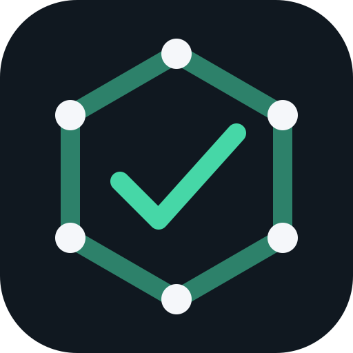
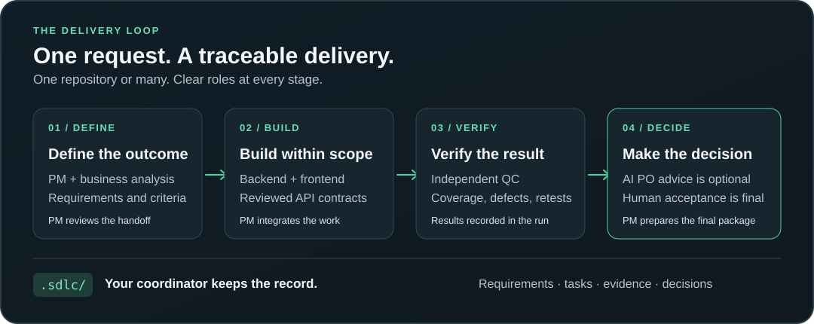

<p align="center">
  
</p>

<h1 align="center">codex-sdlc</h1>

<p align="center">
  <strong>One request. A complete delivery workflow.</strong><br>
  Describe what you want to build. codex-sdlc coordinates the work from requirements to final review.<br>
  You steer the decisions. The AI team carries the process forward.
</p>

<p align="center">
  <a href="https://www.npmjs.com/package/codex-sdlc"></a>
  <a href="https://github.com/prime-vimihi/codex-sdlc/actions/workflows/verify.yml"></a>
  <a href="https://www.npmjs.com/package/codex-sdlc"></a>
  <a href="LICENSE"></a>
</p>

<p align="center">
  <a href="https://chatgpt.com/plugins/plugins_6aa375d1f1d48191b6a2a5f95e1b8a64"><strong>Install the plugin</strong></a>
  &nbsp; · &nbsp;
  <a href="docs/getting-started.md">Getting started</a>
  &nbsp; · &nbsp;
  <a href="docs/agent-models.md">Role models</a>
  &nbsp; · &nbsp;
  <a href="https://github.com/prime-vimihi/codex-sdlc/releases">Releases</a>
</p>

---

## Describe the outcome. Start the workflow.

Once your project is set up, give Codex a feature request in plain language. **codex-sdlc leads the delivery process** through requirements, planning, implementation, integration, independent quality control, and a final delivery report. It brings you in for clarifications and material decisions; final acceptance remains yours.

<p align="center">
  
</p>

**Amber / YOU:** provide the request and make decisions. **Teal / AI:** coordinate and carry out the delivery work.

PM coordinates the stages and reviews each handoff. Frontend work follows the reviewed API contract; independent QC follows integration. The optional AI Product Owner offers advice before PM prepares the final package. **Only you accept delivery.**

### A workflow you can resume

Seven Codex skills and a repository-local CLI keep tasks, evidence, blockers, and decisions in your repository. The next session can continue from recorded state.

| What you need | What codex-sdlc provides |
| --- | --- |
| Turn a simple request into a delivery workflow | Coordinated requirements, implementation, independent QC, and a final report. |
| Continue work across sessions | Saved run manifests, task dependencies, blockers, and decisions. |
| Work across separate codebases | One coordinator with explicit backend, web, and mobile repository mappings. |
| Choose a model for each role | Per-role model and reasoning settings, explicit fallbacks, and dispatch records. |
| Know what was actually verified | Independent QC, acceptance coverage, and recorded command evidence. |
| Stay in control of delivery | Optional AI Product Owner advice followed by your explicit acceptance. |

## Get started

You need **Codex**, **Node.js `>=24.16.0 <25`**, **npm 11**, and an existing application repository. Setup configures your application directories; it does not scaffold application code.

### 1. Install the plugin

Install [codex-sdlc from the Plugins Directory](https://chatgpt.com/plugins/plugins_6aa375d1f1d48191b6a2a5f95e1b8a64), then open your repository in Codex.

### 2. Initialize your project

Ask Codex:

```text
Initialize codex-sdlc for this project. Explain the setup choices
and show the dry run before applying changes.
```

Tell Codex where your backend, web, or mobile applications live. It previews the setup, creates `.sdlc/` and a managed `AGENTS.md` block, restores the pinned runtime, and checks the configuration.

### 3. Start a feature

After setup checks pass:

```text
Start a codex-sdlc feature delivery for: <describe the outcome you want>.
```

To continue later, ask Codex to resume the existing run. Its manifest records the current tasks, completed work, and remaining decisions.

**Version note:** Per-role model routing and AI Product Owner review require both the **0.5.0 plugin and runtime**. Check your installed plugin version; updating the plugin does not upgrade an existing project's runtime. See the [upgrade guide](docs/getting-started.md#upgrade-an-existing-project).

<details>
<summary><strong>Prefer the CLI? Preview a Next.js setup</strong></summary>

Run this against an existing web repository:

```sh
npx --yes codex-sdlc@0.5.0 init \
  --root /absolute/path/to/web --name example-web \
  --applications web --web-root . --web-preset nextjs \
  --dry-run
```

Run the same command without `--dry-run` to apply it, then:

```sh
cd /absolute/path/to/web
node .sdlc/runtime.cjs restore
node .sdlc/runtime.cjs doctor
node .sdlc/runtime.cjs validate-config
```

For a global CLI installation, use `npm install --global codex-sdlc@0.5.0`.

</details>

## Your repositories. Your stack.

Start with a web-only, mobile-only, backend-only, or combined project. Use multi-repository mode when the applications live in separate Git checkouts.

| Layer | Built-in preset |
| --- | --- |
| Backend | Go |
| Web | Next.js |
| Mobile | Flutter |
| Primary database | PostgreSQL |
| Cache | Redis |

Other stacks can use the `generic` application preset with project-specific verification commands. Use `none` when no database preset applies.

**Frontend here, backend elsewhere?** Ask Codex:

```text
Use this frontend repository as the codex-sdlc coordinator.
My Go backend is at /absolute/path/to/backend.
Initialize multi-repository mode with Next.js and Go.
Show the dry run first.
```

The coordinator owns `.sdlc/`. Each mapped checkout must be a Git root with an `origin` remote. Shared configuration records repository identity; ignored `.sdlc/local.yaml` records paths on your machine.

→ [Project setup examples](docs/getting-started.md#common-project-shapes) · [Multi-repository guide](docs/multi-repository.md)

## Choose the team behind the work

Keep Codex's inherited models, or configure a model and reasoning effort for each delivery role.

| Skill | Responsibility |
| --- | --- |
| `sdlc-setup` | Initialize, diagnose, configure, upgrade, roll back, and uninstall. |
| `sdlc-pm` | Coordinate delivery, review handoffs, and prepare the final package. |
| `sdlc-ba` | Define requirements, acceptance criteria, and traceability. |
| `sdlc-backend` | Own API contracts, backend implementation, and data changes. |
| `sdlc-frontend` | Implement the affected web or mobile experience. |
| `sdlc-qc` | Independently verify acceptance coverage, defects, and retests. |
| `sdlc-po` | Provide an optional advisory Product Owner review after QC. |

For example, with a compatible 0.5.0 plugin and runtime:

```text
Use Astra for frontend, Luna for backend, and Sol for PM and QC.
Enable advisory AI Product Owner review with Sol.
Keep other roles inherited and preview the settings first.
```

Selections must be available on your Codex host. New runs snapshot the settings; existing runs keep theirs. An unavailable model stops dispatch unless you configured an explicit fallback. Actual model metadata stays unknown when the host does not report it.

→ [Model configuration, fallbacks, and AI Product Owner review](docs/agent-models.md)

## What stays in your repository

```text
your-coordinator/
├── AGENTS.md                # Managed Codex guidance
└── .sdlc/
    ├── project.yaml         # Project, repositories, presets, role settings
    ├── local.yaml           # Local checkout paths in multi-repo mode (ignored)
    ├── framework.lock.yaml  # Pinned framework installation
    ├── runtime.cjs          # Repository command launcher
    ├── requests/            # Feature requests
    └── runs/                # Manifests, artifacts, decisions, and evidence
```

This is the key-file view; setup also installs the framework's policies, schemas, workflows, and templates. Plugin skills stay in Codex's plugin cache, so a plugin-based setup does not need a project `.agents/skills` folder.

codex-sdlc does not operate a hosted service or send repository content to a codex-sdlc server. Codex and any tools you run have their own data handling. Command evidence is stored locally; configure secret redaction as described in the [security guidance](SECURITY.md) and [privacy policy](docs/privacy.md).

## Upgrade with a way back

Preview a project upgrade before applying it:

```sh
npx --yes codex-sdlc@0.5.0 upgrade \
  --root /absolute/path/to/coordinator --dry-run
```

Applied upgrades create backups. Rollback checks managed-file integrity before restoring them. Uninstall preserves project configuration, requests, run history, and application code.

→ [Upgrade an existing project](docs/getting-started.md#upgrade-an-existing-project) · [CLI setup and lifecycle reference](docs/cli-reference.md)

## Explore the documentation

| Start here | Go deeper |
| --- | --- |
| [Getting started](docs/getting-started.md) | [CLI setup and lifecycle reference](docs/cli-reference.md) |
| [Multi-repository workspaces](docs/multi-repository.md) | [Role models and dispatch records](docs/agent-models.md) |
| [What's new in 0.5.0](docs/releases/0.5.0.md) | [Release history](https://github.com/prime-vimihi/codex-sdlc/releases) |
| [Support](SUPPORT.md) | [Contributing](CONTRIBUTING.md) |

Current verification includes macOS CI, the automated runtime tests, plugin and skill validation, and a live PM dispatch smoke test. Native Linux/Windows qualification and a complete delivery test spanning multiple models remain pending. See the [0.5.0 validation notes](docs/releases/0.5.0.md#validation).

## Build with us

Try codex-sdlc on a project, [report a reproducible issue](https://github.com/prime-vimihi/codex-sdlc/issues), or [contribute an improvement](CONTRIBUTING.md). For security reports, follow [SECURITY.md](SECURITY.md).

```sh
npm ci
npm run verify
```

See the [contributor reference](docs/cli-reference.md#local-codex-plugin-marketplace) for building and testing a local plugin marketplace. Licensed under [Apache-2.0](LICENSE).

<p align="center">
  <strong>Start with one feature. Keep the evidence for the next session.</strong><br>
  <a href="docs/getting-started.md">Get started with codex-sdlc →</a>
</p>
